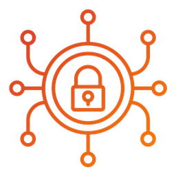

# Cybersecurity Policy Templates

This project aims to simplify the complex cybersecurity challenges faced by small and medium-sized businesses (SMBs) by providing free access to [policy templates](pages/overview/template-overview.md), [implementation guides](pages/guides/guides.md), and [resources](pages/resources/resources.md).

## Statistics Test

<table data-card-size="large" data-view="cards"><thead><tr><th></th><th data-hidden></th><th data-hidden></th><th data-hidden data-card-target data-type="content-ref"></th></tr></thead><tbody><tr><td><h4>Write Apps</h4><ul class="contains-task-list"><li><input type="checkbox" checked>Build apps using GTK and Granite</li><li><input type="checkbox" checked>Set up a Meson build system</li><li><input type="checkbox" checked>Work with Gettext translations</li><li><input type="checkbox" checked>Package your app with Flatpak</li></ul></td><td></td><td></td><td><a href="writing-apps/our-first-app/">our-first-app</a></td></tr><tr><td><h4>Publish in AppCenter</h4><ul class="contains-task-list"><li><input type="checkbox" checked>Review publishing requirements</li><li><input type="checkbox" checked>Monetize your app</li><li><input type="checkbox" checked>Submit for review with GitHub</li><li><input type="checkbox" checked>Publish Updates</li></ul></td><td></td><td></td><td><a href="appcenter/submission-process.md">submission-process.md</a></td></tr></tbody></table>

## Stats Test 2

<table data-card-size="large" data-view="cards"><thead><tr><th></th><th data-hidden></th><th data-hidden></th><th data-hidden data-card-target data-type="content-ref"></th></tr></thead><tbody><tr><td><h4>Cyberattacks</h4><ul class="contains-task-list"><li><input type="checkbox" checked>44% of SMBs have experienced a cyberattack</li><li><input type="checkbox" checked>82% of ransomware attacks in 2021 targeted SMBs</li><li><input type="checkbox" checked>61% of SMBs were targeted by attacks in 2021</li><li><input type="checkbox" checked>46% of cybersecurity breaches affected SMBs</li><li><input type="checkbox" checked>72% of SMBs reported an attack or data breach in 2019</li><li><input type="checkbox" checked>69% of SMBs reported increasingly targeted attacks in 2019</li></ul></td><td></td><td></td><td></td></tr><tr><td><h4>Cybersecurity Posture</h4><ul class="contains-task-list"><li><input type="checkbox" checked>62% of SMBs lack an up-to-date security strategy</li><li><input type="checkbox" checked>50% of SMBs lacked a cybersecurity plan in 2022</li><li><input type="checkbox" checked>77% of SMBs reported inadequate cybersecurity personnel in 2019</li><li><input type="checkbox" checked>76% of SMBs attemt to manage cybersecurity without external resources</li><li><input type="checkbox" checked>52% of SMBs lack confidence in their ability to prevent cyberattacks</li><li><input type="checkbox" checked>73% of SMBs cite cybersecurity as their greatest risk</li></ul></td><td></td><td></td><td></td></tr></tbody></table>

## Statistics

The small business cybersecurity statistics paint a stark picture, underscoring the critical and immediate need for SMBs to fortify their cybersecurity strategies or risk becoming prime targets for increasingly sophisticated and damaging cyberattacks.

### Small Business Cyberattacks

* [44% of SMBs have experienced a cyberattack](https://www.mcafee.com/en-gb/consumer-corporate/newsroom/press-releases/2024/20240117.html)
* [82% of ransomware attacks in 2021 targeted SMBs](https://www.law.umaryland.edu/content/articles/name-659577-en.html)
* [61% of SMBs were targeted by cyberattacks in 2021](https://www.mcafee.com/en-gb/consumer-corporate/newsroom/press-releases/2024/20240117.html)
* [46% of cybersecurity breaches affected SMBs](https://www.verizon.com/business/resources/Ta9b/reports/2021-data-breach-investigations-report.pdf)
* [72% of respondents to a 2019 study experienced a cyberattack or data breach](https://www.cisco.com/c/dam/en/us/products/collateral/security/ponemon-report-smb.pdf)
* [69% of respondents to the same survey noted increasingly targeted cyberattacks](https://www.cisco.com/c/dam/en/us/products/collateral/security/ponemon-report-smb.pdf)

### Inadequate Cybersecurity Posture

* [62% of SMBs lack an up-to-date security strategy](https://www.vistage.com/wp-content/uploads/2018/04/Cybersecurity-Research-Note.pdf)
* [Only 50% of SMBs had any cybersecurity plan in place in 2022](https://upcity.com/experts/small-business-cybersecurity-survey/)
* [77% of respondents to a 2019 study reported inadequate cybersecurity personnel](https://www.cisco.com/c/dam/en/us/products/collateral/security/ponemon-report-smb.pdf)
* [76% of SMBs attempt to manage cybersecurity without external resources or expertise](https://www.vistage.com/wp-content/uploads/2018/04/Cybersecurity-Research-Note.pdf)
* [52% of SMBs lack confidence in their ability to prevent cyberattacks](https://www.mcafee.com/en-gb/consumer-corporate/newsroom/press-releases/2024/20240117.html)
* [73% of SMBs cite cybersecurity as their greatest risk](https://www.mcafee.com/en-gb/consumer-corporate/newsroom/press-releases/2024/20240117.html)

## Policy Templates

Developing policies that align with cybersecurity frameworks can be costly and time-consuming for small businesses. This project provides [free cybersecurity policy templates](pages/overview/template-overview.md), [implementation guides](pages/guides/guides.md), and [resources](pages/resources/resources.md) to relieve SMBs from the need to purchase policies, hire consultants, or dedicate significant resources to policy creation. Although not designed to fully meet every compliance requirement, these templates follow the [NIST Cyberscurity Framework 2.0 (NSIT CSF 2.0)](https://www.nist.gov/cyberframework) core functions of [Govern](pages/govern/govern.md), [Identify](pages/identify/identify.md), [Protect](pages/protect/protect.md), [Detect](pages/detect/detect.md), [Respond](pages/respond/respond.md), and [Recover](pages/recover/)

## Frameworks

Small businesses don’t need to reinvent the wheel to enhance their cybersecurity. Instead, SMBs can adopt [existing cybersecurity frameworks](pages/resources/frameworks.md) that offer clear, structured approaches for identifying, assessing, prioritizing, and mitigating cybersecurity risks. These frameworks enable small businesses to implement standardized practices, build resilience, and maintain trust with customers and partners, even when IT resources are limited. Prominent cybersecurity framework providers include the [National Institute of Standards and Technology (NIST)](https://www.nist.gov/cybersecurity), [International Organization for Standardization (ISO)](https://iso.org/sectors/it-technologies/information-security), and the [Center for Internet Security (CIS)](https://www.cisecurity.org). While these frameworks are effective, they can also be complex and challenging to implement. This project aims to simplify that process, offering small businesses a practical starting point for adopting a cybersecurity program based on existing frameworks.

## Policies

Policies form the foundation of any effective cybersecurity program. While frameworks outline the broad strategies for managing risks, policies specify how these strategies are applied and enforced within a business. Together, frameworks and policies create a cohesive system that enhances a business’s overall cybersecurity posture. By translating the framework’s guidelines into actionable processes, policies help ensure that employees understand their roles and responsibilities in maintaining security. Well-defined and implemented policies establish accountability, streamline decision-making, and ensure consistent responses to cybersecurity incidents, minimizing the risk of human error.

## References

* [https://www.mcafee.com/en-gb/consumer-corporate/newsroom/press-releases/2024/20240117.html](https://www.mcafee.com/en-gb/consumer-corporate/newsroom/press-releases/2024/20240117.html)
* [https://www.law.umaryland.edu/content/articles/name-659577-en.html](https://www.law.umaryland.edu/content/articles/name-659577-en.html)
* [https://www.verizon.com/business/resources/Ta9b/reports/2021-data-breach-investigations-report.pdf](https://www.verizon.com/business/resources/Ta9b/reports/2021-data-breach-investigations-report.pdf)
* [https://www.cisco.com/c/dam/en/us/products/collateral/security/ponemon-report-smb.pdf](https://www.cisco.com/c/dam/en/us/products/collateral/security/ponemon-report-smb.pdf)
* [https://www.vistage.com/wp-content/uploads/2018/04/Cybersecurity-Research-Note.pdf](https://www.vistage.com/wp-content/uploads/2018/04/Cybersecurity-Research-Note.pdf)
* [https://upcity.com/experts/small-business-cybersecurity-survey](https://upcity.com/experts/small-business-cybersecurity-survey)
* [https://www.nist.gov/cybersecurity](https://www.nist.gov/cybersecurity)
* [https://iso.org/sectors/it-technologies/information-security](https://iso.org/sectors/it-technologies/information-security)
* [https://www.cisecurity.org](https://www.cisecurity.org)
